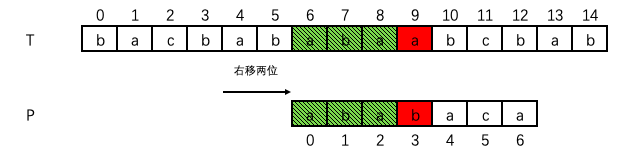

#### 模式匹配问题

给定文本串 T[0: m]，以及模式串 P[0: n]，其中 n ≤ m。

如果存在 T[s: s + n] = P[0: n]，0 ≤ s ≤ s + n ≤ m，那么称 P 在 T 中出现，且 s 是有效偏移，模式匹配问题就是找到 P 在 T 中出现的所有有效偏移。

>[] 类似 go/python 的描述，是一个左闭右开的区间。

#### KMP 算法的本质

**KMP 算法的本质就是剪枝**。所谓剪枝，一般是**利用关系的传递性为依据来避免无效比对**，最常见的关系是数量关系（<,>, =）。利用数量关系进行剪枝的经典算法 / 数据结构包括：二分查找、快速排序、红黑树、α-β剪枝等。

KMP 算法的关系构建比朴素的数量关系复杂一些，它是**利用模式串的前后缀信息来构建关系**。这里也是很多同学困惑的一个点——前后缀信息是如何影响模式匹配的？

我们举一个朴素的🌰：

如图所示，T[9] 在匹配 P[5] 时失败。

如果采用暴力搜索的方式进行模式匹配，下一轮次是 T[5] 与 P[0] 进行比对：

显然，T[5] 与 P[0] 并不匹配。

不难看出，当 T[4] 和 P[0] 同时右移两位后，T 和 P 前几个字符是匹配的：

巧合的是，T[9] 在匹配模式串 P[3] 的时候也失败了。

于是，为了避免对无效的偏移进行比对（剪枝），不难想到：在模式匹配失败后，我们**仅对匹配失败的位置再次比对，对于已经匹配成功的位置不再进行重复比对**。目标就是**计算出右移的最小偏移量**（示例中是两位）。

#### KMP-MATCHER 过程

不失一般性，我们对右移的过程进行分析：

欲使右移的偏移量最小，则应使 j'值取最大，即亦**在模式串 P 中寻找具有相同真前缀和真后缀的最大长度**。在 KMP 算法中，用于存储这一组值的数据结构是 **next 数组**。如图所示，next[j - 1] = j'，表示 P[0:j] 中相同真前缀和真后缀的最大长度为 j'，即 P[0: j'] = P[j - j': j]。

next[q] = max{j: j < q 且 P[0: j] 是 P[0: q] 的真后缀}

> 真前 / 后缀概念类似” 真子集 “，即不含串本身的前缀。

当 T[i] 与 P[j] 失配时，我们可以根据 next[j - 1] 的指示找到 P[j']。

- 如果 T[i] 和 P[j'] 匹配，我们继续比较 T[i + 1] 和 P[j' + 1]。
- 如果 T[i] 与 P[j'] 失配，我们根据 next[j' - 1] 的指示找到 P[[next[j' - 1]]，让 T[i] 与 P[[next[j' - 1]] 比对，依次类推，直到跳回到 P[0]。若 T[i] 与 P[0] 也失配，说明 T[i] 不可能出现在解中，故以 T[i + 1] 为始点与模式串 P 进行比对。

具体地，我们在碱基序列”CAAGAAAUAUAUACCUCACU“上查找”AUAUAC“。并已知 next 数组如下：

KMP 匹配过程如图所示：

#### 计算 next 数组

实际上，**我们可以将求解 next 数组的问题看做一个模式匹配问题，模式串 P 既是文本串又是模式串**。

计算 next[i] 时，我们可以将包含 P[0: i + 1] 的真后缀当做文本串，寻找在模式串 P[0: i + 1] 中寻找最长真前缀 P[0: j‘]。

我们可以根据 next[i - 1] 的指示找到 P[j]。

- 如果 P[i] 与 P[j] 匹配，next[i] = j + 1
- 如果 P[i] 与 P[j] 失配，我们根据 next[j - 1] 的指示找到 j'，让 P[i] 与 P[j'] 比对，依次类推，直到跳回到 P[0]。若 P[i] 与 P[0] 也失配，则 next[i] = 0。

不难看出，next 数组本质上是一棵树，采用双亲表示法存储，用于存放下一次比对的位置。

我们以求”AUAUAC“的 next 数组为例，求解过程如下：

#### ” 剪枝 “正确性证明

不难看出，KMP 算法相较于暴力搜索剪掉了文本串中已匹配对象的二次比对。更通俗的说法：i 值不会”回退 “，剪掉了暴力搜索中” 右移“的那部分分枝。这样剪枝是否会剪掉正确的解呢？

通过反证法证明：

假设存在 x: i - j <x < i - j' ，T[x: x + n] 与 P[0: n] 匹配。

=> 则存在真前缀 T[x: i]=P[0: i - x]。

又知，T[x: i] = P[j - (i - x): j]。

=> P[0: i - x] = P[j - (i - x): j]，next[j - 1] = i - x > j'，与条件 next[j - 1] = j’矛盾，假设不成立。

故 KMP 的剪枝策略是正确的。

#### 实现	

[LeetCode 28](https://leetcode.cn/problems/find-the-index-of-the-first-occurrence-in-a-string/description/)

#### 时间复杂度分析

##### 计算 next 数组

O(n)

##### KMP-Matcher

O(m)

总体时间复杂度：O(m + n)
